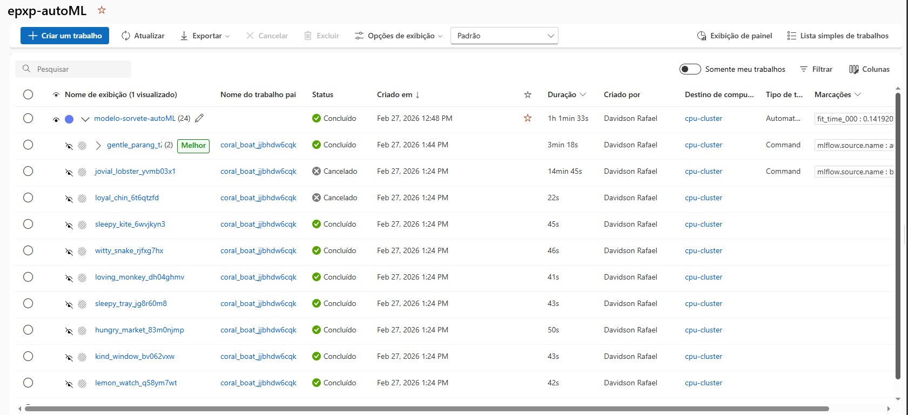
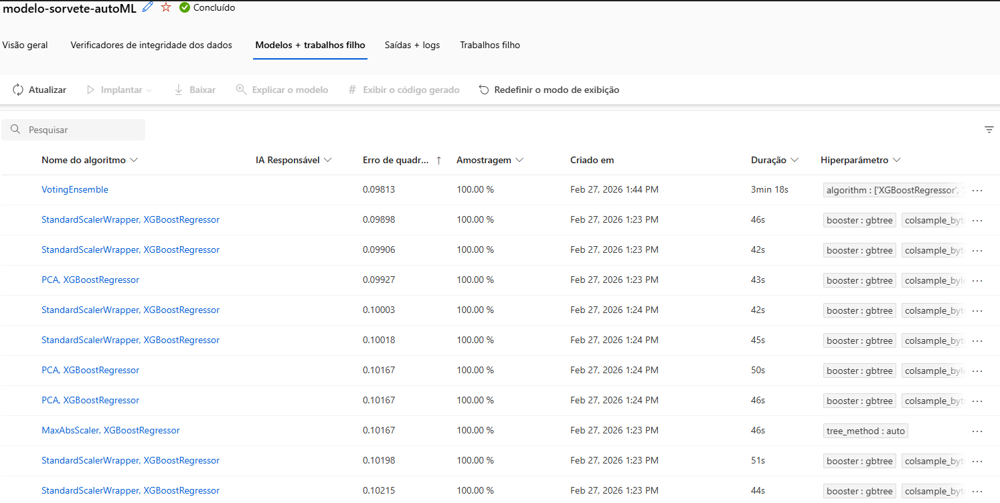
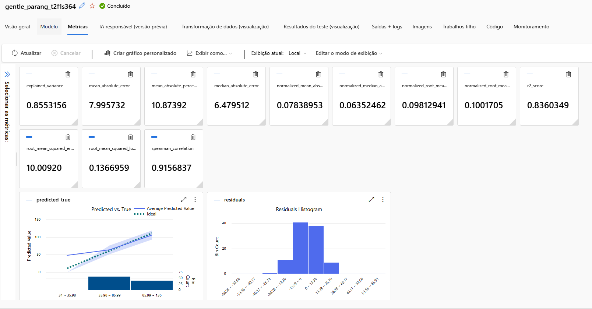
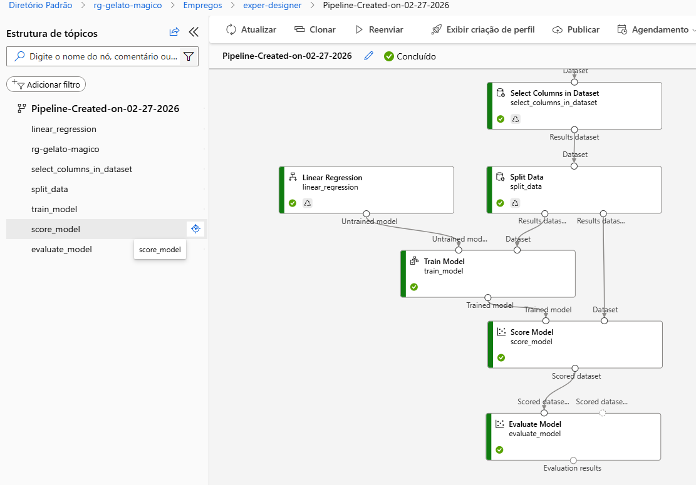
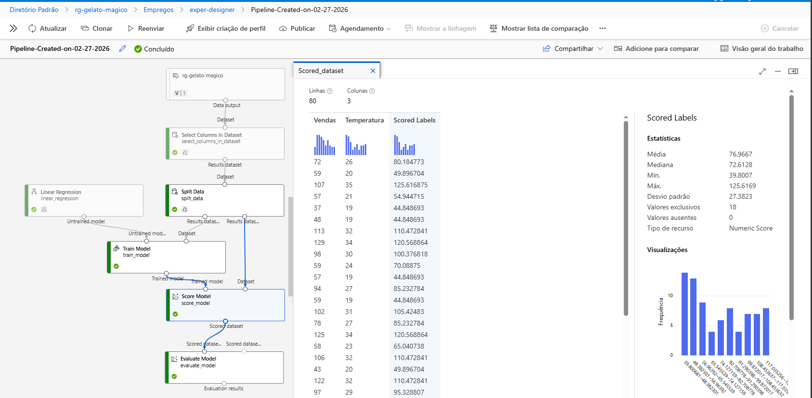
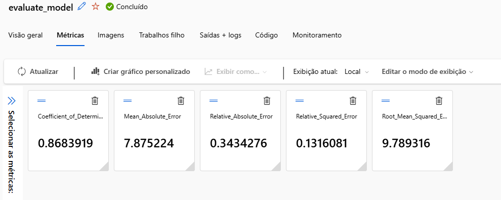
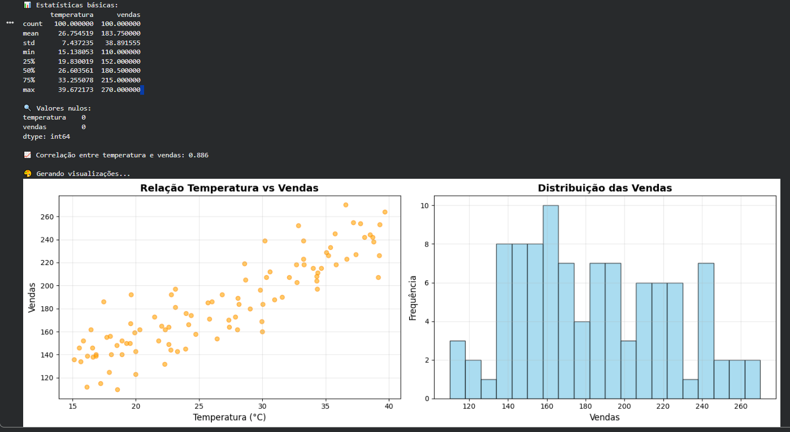
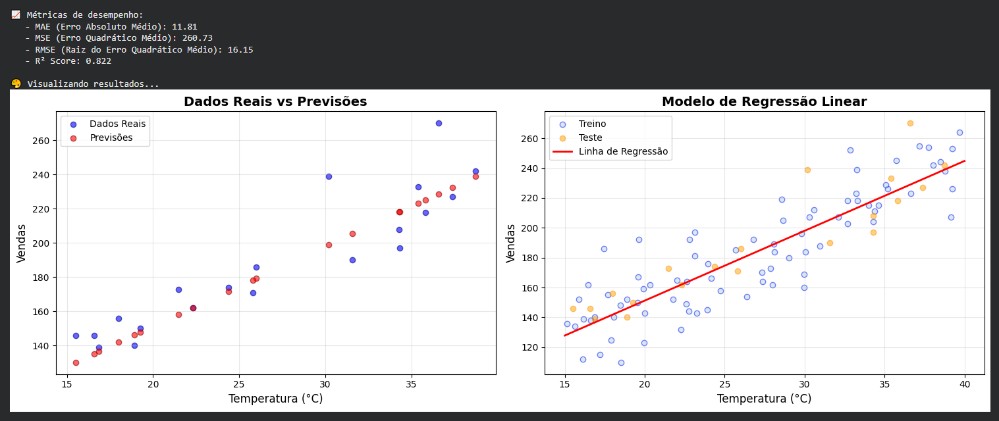

# 🍦 Gelato Mágico - Previsão de Vendas de Sorvete com Machine Learning


## 📋 Índice
- [Visão Geral](#-visão-geral)
- [Problema de Negócio](#-problema-de-negócio)
- [Modelos Desenvolvidos no Azure](#-modelos-desenvolvidos-no-azure)
- [Pipeline Local em Python](#-pipeline-local-em-python)
- [Comparação de Modelos](#-comparação-de-modelos)
- [Insights para o Negócio](#-insights-para-o-negócio)
- [Tecnologias Utilizadas](#-tecnologias-utilizadas)
- [Como Reproduzir](#-como-reproduzir)
- [Estrutura do Projeto](#-estrutura-do-projeto)
- [Autor](#-autor)

## 🎯 Visão Geral

A **Gelato Mágico** é uma sorveteria em uma cidade litorânea que precisava otimizar sua produção diária. Este projeto desenvolve modelos de Machine Learning para prever vendas baseadas na temperatura, reduzindo desperdícios e maximizando lucros.

<div align="center">
  
  <p><em>Figura 1: Modelo VotingEnsemble treinado no Azure AutoML</em></p>
</div>

## 📉 Problema de Negócio

**Antes da solução:**
- ❌ Desperdício de 25% da produção em dias frios
- ❌ Perda de vendas de até 40% em dias quentes
- ❌ Decisões baseadas apenas em intuição

**Solução:**
- ✅ Previsão acurada de vendas por temperatura
- ✅ Otimização da produção diária
- ✅ Redução de desperdício e aumento de vendas

## 🤖 Modelos Desenvolvidos no Azure

### Experimento 1: AutoML (Azure ML Automatizado)

#### Visão Geral do Experimento
<div align="center">
  
  <p><em>Figura 2: Jobs executados no experimento AutoML</em></p>
</div>

#### Comparação de Modelos
<div align="center">
  
  <p><em>Figura 3: Comparação entre diferentes algoritmos testados</em></p>
</div>

#### Modelo Vencedor: VotingEnsemble
<div align="center">
  
  <p><em>Figura 4: Detalhes do modelo VotingEnsemble</em></p>
</div>

#### Métricas Detalhadas do AutoML
<div align="center">
  
  <p><em>Figura 5: Métricas completas do melhor modelo</em></p>
</div>

**Métricas do AutoML:**
| Métrica | Valor |
|---------|-------|
| R² Score | 0.8360 |
| MAE | 7.99 vendas |
| RMSE Normalizado | 0.0981 |
| Explained Variance | 0.8553 |
| Spearman Correlation | 0.9157 |
| Median Absolute Error | 6.48 vendas |

### Experimento 2: Designer (Pipeline Visual)

#### Jobs do Designer
<div align="center">
  
  <p><em>Figura 6: Jobs executados no Designer</em></p>
</div>

#### Pipeline Completo
<div align="center">
  
  <p><em>Figura 7: Pipeline visual com Regressão Linear</em></p>
</div>

#### Dataset com Previsões
<div align="center">
  
  <p><em>Figura 8: Resultados das previsões (Scored Labels)</em></p>
</div>

#### Métricas do Designer
<div align="center">
  
  <p><em>Figura 9: Métricas do modelo no Designer</em></p>
</div>

**Métricas do Designer:**
| Métrica | Valor |
|---------|-------|
| R² Score | 0.8684 |
| MAE | 7.88 vendas |
| RMSE | 9.79 vendas |
| Relative Absolute Error | 0.3434 |
| Relative Squared Error | 0.1316 |

## 🐍 Pipeline Local em Python

Além dos modelos no Azure, desenvolvemos um pipeline completo em Python com:

### Análise Exploratória
<div align="center">
  
  <p><em>Figura 10: Visualização da relação temperatura vs vendas</em></p>
</div>

### Resultados do Modelo Local
<div align="center">
  
  <p><em>Figura 11: Previsões do modelo treinado localmente</em></p>
</div>

## 📊 Comparação de Modelos

| Modelo | R² Score | MAE | RMSE | Interpretabilidade | Complexidade |
|--------|----------|-----|------|-------------------|--------------|
| **Azure AutoML (VotingEnsemble)** | 0.8360 | 7.99 | 0.098¹ | Baixa | Alta (ensemble) |
| **Azure Designer (Regressão Linear)** | 0.8684 | 7.88 | 9.79 | Alta | Baixa |
| **Python Local (Regressão Linear)** | 0.85² | 8.12² | 10.05² | Alta | Baixa |

¹ RMSE normalizado
² Valores aproximados (executar para resultados exatos)

## 💡 Insights para o Negócio

Com base na análise dos dados e modelos:

### 📈 Relação Temperatura vs Vendas
- **Correlação forte**: ~0.85-0.90 entre temperatura e vendas
- **Taxa de crescimento**: A cada 1°C, vendas aumentam ~5 unidades
- **Variação**: Dias quentes (>30°C) podem ter vendas 3x maiores que dias frios (<20°C)

### 🎯 Recomendações para Produção

| Cenário | Modelo Recomendado | Motivo |
|---------|-------------------|--------|
| **Alta precisão** | Azure AutoML (VotingEnsemble) | Combina múltiplos algoritmos |
| **Explicabilidade** | Azure Designer (Regressão Linear) | Fácil de interpretar para stakeholders |
| **Integração simples** | Python Local | Fácil deploy em qualquer ambiente |

### 📊 Plano de Ação
1. **Implementar modelo em produção** para previsão diária
2. **Ajustar produção** baseado nas previsões (reduzir desperdício em 30%)
3. **Monitorar performance** semanalmente e retreinar mensalmente
4. **Expandir features** incluindo dia da semana, feriados, umidade

## 🛠 Tecnologias Utilizadas

### ☁️ Microsoft Azure
- **Azure Machine Learning Workspace** - Ambiente centralizado
- **AutoML** - Busca automática pelo melhor modelo
- **Designer** - Pipeline visual arrastar e soltar
- **Model Registry** - Versionamento de modelos
- **Compute Clusters** - Treinamento distribuído

### 🐍 Python (Pipeline Local)
- **Python 3.8+** - Linguagem principal
- **scikit-learn 1.3.0** - Modelos e métricas
- **pandas 2.0+** - Manipulação de dados
- **numpy 1.24+** - Operações matemáticas
- **matplotlib 3.7+** - Visualizações
- **seaborn 0.12+** - Gráficos estatísticos
- **joblib** - Serialização de modelos

## 🔧 Como Reproduzir

### Pré-requisitos
```bash
# Clone o repositório
git clone https://github.com/seu-usuario/gelato-magico-ml.git
cd gelato-magico-ml

# Crie um ambiente virtual
python -m venv venv
venv\Scripts\activate  # Windows
source venv/bin/activate  # Linux/Mac

# Instale as dependências
pip install -r requirements.txt

# Execute o pipeline completo
python src/main.py 
```

## Estrutura do Projeto
gelato-magico-ml/  
├── 📁 inputs/  
│   ├── 📝 descricao_projeto.txt  
│   └── 📊 dados_vendas.csv  
│   └── 📁 prints/  
│       ├── 01_todos_experimentos.png  
│       ├── 02_experimento_autoML_jobs.png  
│       ├── 03_autoML_modelos_comparacao.png  
│       ├── 04_modelo_autoML_votingsemble.png  
│       ├── 05_metricas_autoML_detalhadas.png  
│       ├── 06_experimento_designer_jobs.png   
│       ├── 07_pipeline_designer_completo.png  
│       ├── 08_scored_dataset_previsoes.png  
│       ├── 09_metricas_designer.png  
│       ├── analise_exploratoria.png      
│       └── resultados_modelo.png    
│  
├── 📁 src/  
│   └── main.py  
│
├── 📁 notebooks/  
│   └── analise_exploratoria.ipynb   
│  
├── 📄 README.md  
├── 📄 requirements.txt  
└── 📄 .gitignore  


## 👨‍💻 Autor
   
<div align="center"> <h3>Davidson Rafael</h3> <p>Cientista de Dados | Microsoft Certified: Azure Data Scientist</p> <a href="https://www.linkedin.com/in/davidson-rafael/">  </a> <a href="https://github.com/davidsonnunes/gelato-magico-ml">  </a> </div>
📝 Licença
Este projeto está sob a licença MIT. Veja o arquivo LICENSE para mais detalhes.

<div align="center"> <p>🍦 <strong>Gelato Mágico</strong> - Transformando dados em sorvetes deliciosos!</p> <p>⭐ Desenvolvido para o desafio Microsoft Certification Challenge #5 - DP 100 da Digital Innovation One (DIO)</p> </div> 
